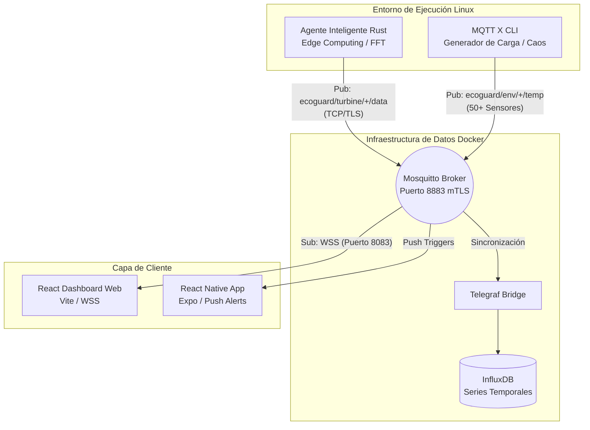

# EcoGuard: Arquitectura IoT Emulada para Gestión Predictiva de Microredes 🌬️⚡

[cite_start]EcoGuard es un sistema avanzado de monitoreo de condición diseñado para la gestión y el mantenimiento predictivo de microredes de energía renovable[cite: 1, 2, 121, 125].

## 🎯 Objetivo del Proyecto

[cite_start]El principal desafío en la industria energética es el alto costo asociado a fallos mecánicos no detectados en activos dispersos como turbinas eólicas [cite: 12, 132-134]. [cite_start]Los simuladores IoT tradicionales suelen generar datos aleatorios ("ruido") que no permiten validar algoritmos reales de mantenimiento predictivo[cite: 13].

[cite_start]**EcoGuard** resuelve esto implementando un "Gemelo Digital" emulado puramente en software (sobre Linux) que genera física de alta fidelidad sin necesidad de hardware[cite: 15, 126, 142, 143]. [cite_start]En lugar de números aleatorios, el sistema sintetiza ondas mecánicas complejas, procesa la Transformada Rápida de Fourier (FFT) en el borde y evalúa el estado de salud de la maquinaria utilizando el estándar industrial ISO 10816 [cite: 42, 59-64, 128, 174, 175].

---

## 🏗️ Arquitectura del Sistema

[cite_start]La arquitectura sigue un modelo distribuido y de "Confianza Cero" (Zero Trust), dividida en generación de borde, infraestructura de datos y capa de visualización[cite: 31, 204].



### Componentes Principales

- **Agente Inteligente (Rust):** Binario nativo que emula el desgaste mecánico de la turbina, calcula la FFT y determina zonas de salud (A/B/C/D) .

- **Broker MQTT (Eclipse Mosquitto):** Enrutador central asegurado con autenticación mutua (mTLS) y listas de control de acceso (ACL).

- **Generador de Carga (MQTT X CLI):** Inyecta ruido ambiental masivo para validar la robustez y escalabilidad de la red .

- **Persistencia (InfluxDB + Telegraf):** Almacenamiento optimizado para métricas de series temporales de alta velocidad .

- **Ecosistema Reactivo:** Dashboard web (React) para ver el espectro FFT a 30fps y App Móvil (React Native) para gestión por excepción y alertas críticas .

---

## 🚀 Guía de Instalación y Despliegue

### Requisitos Previos

- Sistema Operativo Linux (Recomendado: Fedora/Ubuntu).

- Docker y Docker Compose.

- Rust y Cargo (`rustup`).

- Node.js y npm.

- OpenSSL.

### Paso 1: Configurar Seguridad y Certificados (mTLS)

El sistema requiere autenticación mutua. Debes generar tu propia Autoridad Certificadora (CA) y las llaves para cada cliente .

1. Ejecuta el script de generación de certificados: `./generate_certs.sh`.
2. Asegúrate de que los certificados se guarden en el directorio `./certs`. _(Nota: este directorio debe estar en tu `.gitignore`)_.

Nota importante sobre rutas de certificados:

- El script `generate_certs.sh` genera los certificados en `./certs` y además copia automáticamente los archivos necesarios a `./mosquitto/config/certs` para que el broker Mosquitto (que monta `./mosquitto/config`) tenga acceso a los mismos ficheros. Esto permite que Telegraf lea `./certs` mientras que Mosquitto utiliza `./mosquitto/config/certs`.

Si prefieres mantener los certificados en otra ubicación, actualiza `docker-compose.yaml` (montajes) y `mosquitto/config/mosquito.conf` (rutas) correspondientemente.

### Paso 2: Configurar Reglas de Acceso (ACLs)

Mosquitto restringe quién puede publicar y suscribirse a los tópicos .

1. Coloca el archivo `acl.conf` dentro del directorio de configuración de Mosquitto (`./mosquitto/config/`).
2. Verifica que el Agente Rust tenga permisos exclusivos de escritura (`pub`) y los dashboards permisos de lectura (`sub`).

### Paso 3: Levantar la Infraestructura

Inicia el broker de mensajes y la base de datos de series temporales :

```bash
docker compose up -d

```

Nota: el broker expone los puertos `1883`, `8883` (mTLS) y `8083` (WSS para el dashboard web). Asegúrate de no exponer estos puertos en entornos públicos sin las medidas de seguridad necesarias.

### Paso 4: Ejecutar el Gemelo Digital (Agente Rust)

Posiciónate en el directorio del agente Rust para comenzar a emular la física de la turbina eólica y enviar telemetría a Mosquitto .

```bash
cd ecoguard-agent
cargo run
```

### Paso 5: Prueba de Estrés (Generación de Caos)

Para validar que el sistema no se congele bajo estrés, ejecuta el generador de carga MQTT X para simular 50 sensores adicionales :

```bash
./run_chaos.sh

```

### Paso 6: Configuración del Dashboard Web y Certificado del Navegador

El Dashboard en React se conecta vía WebSockets Seguros (WSS). Para que la conexión mTLS funcione, tu navegador web debe presentar su propia identidad criptográfica.

1. **Empaquetar el Certificado:** En la carpeta `certs/`, convierte tu certificado del dashboard a formato `.p12` (el sistema te pedirá crear una contraseña):

```bash
openssl pkcs12 -export -out dashboard.p12 -inkey dashboard.key -in dashboard.crt -certfile ca.crt

```

2. **Importar al Navegador:**
   Una vez que hayas generado el archivo `dashboard.p12`, necesitas cargarlo en el almacén de confianza de tu navegador.
   **Para Chrome / Edge:**

- Ve a Configuración > Privacidad y seguridad > Seguridad.
- Desplázate hacia abajo y haz clic en Gestionar certificados.
- Ve a la pestaña Tus certificados (o Personal) y haz clic en Importar.

**Para Firefox:**

- Ve a Ajustes > Privacidad & Seguridad.
- Desplázate hacia abajo hasta la sección Certificados y haz clic en Ver Certificados.
- Bajo la pestaña Tus Certificados, haz clic en Importar.

3. **Iniciar el Dashboard:**

```bash
cd ecoguard-dashboard
npm run dev

```

App móvil (React Native):

- Se ha añadido una app mínima de React Native en `ecoguard-dashboard/mobile/`. Puedes usar Expo para desarrollo rápido (`cd ecoguard-dashboard/mobile && npm install && npm run start`). Para despliegues móviles reales ten en cuenta que la gestión de certificados cliente (mTLS) normalmente requiere soporte nativo adicional o un proxy seguro.

---

**Nota de Seguridad:** NUNCA subas los archivos `.key` o el directorio `certs/` a repositorios públicos.

Sobre el ejemplo y privacidad:

- El archivo `generate_certs.sh.example` contiene un ejemplo con marcadores de posición (`<<INSERT_...>>`) para evitar exponer información sensible en el repositorio. Usa ese ejemplo como plantilla y ejecuta `generate_certs.sh` localmente para crear tus propios certificados con datos reales en tu equipo. Nunca incluyas llaves privadas ni certificados reales en commits públicos.
