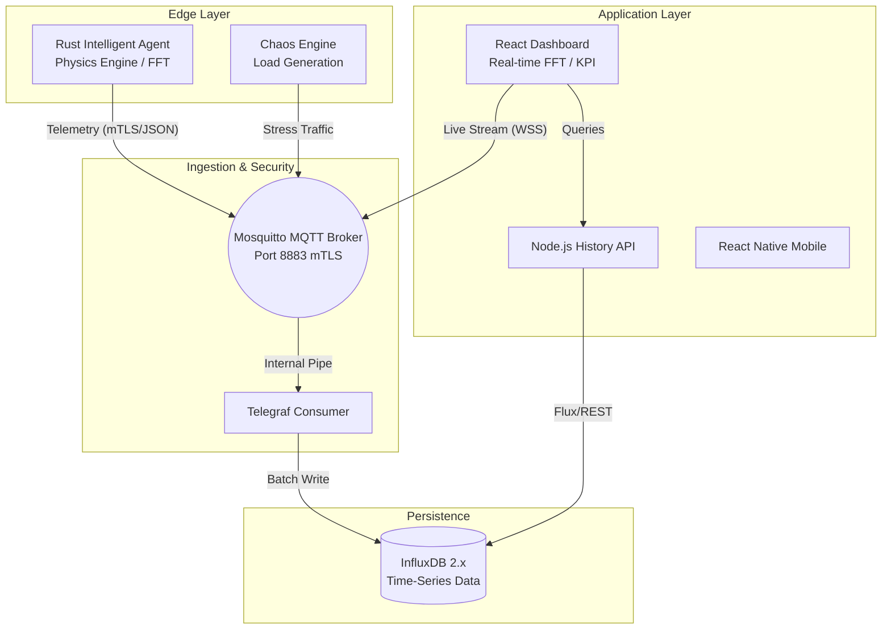
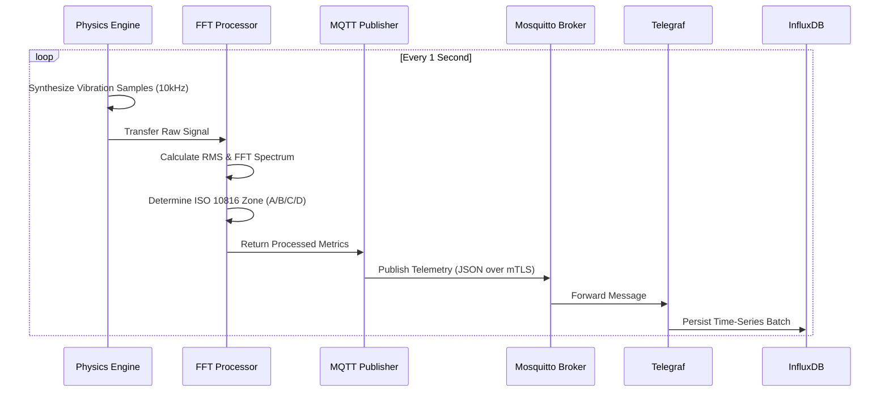

# EcoGuard: Digital Twin Architecture for Microgrid Predictive Maintenance

EcoGuard is a Condition Monitoring System (CMS) designed for the predictive maintenance of renewable energy assets. It utilizes an emulated Digital Twin approach to generate high-fidelity mechanical telemetry, enabling the validation of predictive algorithms without physical hardware.

## System Overview

The project addresses the high operational expenditure (OPEX) of wind turbine maintenance by providing a software-defined environment that synthesizes realistic mechanical vibrations. Unlike standard simulators that generate stochastic noise, EcoGuard implements:
- Harmonic signal synthesis (1x, 2x, 3x harmonics).
- Real-time Edge Computing (FFT processing).
- Health classification based on the ISO 10816 industrial standard.
- Zero Trust security model via Mutual TLS (mTLS).

## System Architecture

The architecture is distributed across Edge, Ingestion, Persistence, and Application layers.

```mermaid
graph TD
    subgraph EdgeLayer [Edge Layer]
        Agent[Rust Intelligent Agent<br/>Physics Engine / FFT]
        Chaos[Chaos Engine<br/>Load Generation]
    end

    subgraph IngestionLayer [Ingestion & Security]
        Broker((Mosquitto MQTT Broker<br/>Port 8883 mTLS))
        Telegraf[Telegraf Consumer]
    end

    subgraph PersistenceLayer [Persistence]
        InfluxDB[(InfluxDB 2.x<br/>Time-Series Data)]
    end

    subgraph AppLayer [Application Layer]
        WebDash[React Dashboard<br/>Real-time FFT / KPI]
        HistoryAPI[Node.js History API]
        MobileApp[React Native Mobile]
    end

    Agent -- "Telemetry (mTLS/JSON)" --> Broker
    Chaos -- "Stress Traffic" --> Broker
    Broker -- "Internal Pipe" --> Telegraf
    Telegraf -- "Batch Write" --> InfluxDB
    WebDash -- "Live Stream (WSS)" --> Broker
    WebDash -- "Queries" --> HistoryAPI
    HistoryAPI -- "Flux/REST" --> InfluxDB
```

### Data Flow Sequence

```mermaid
sequenceDiagram
    participant P as Physics Engine
    participant F as FFT Processor
    participant M as MQTT Publisher
    participant B as Mosquitto Broker
    participant T as Telegraf
    participant I as InfluxDB

    loop Every 1 Second
        P->>P: Synthesize Vibration Samples (10kHz)
        P->>F: Transfer Raw Signal
        F->>F: Calculate RMS & FFT Spectrum
        F->>F: Determine ISO 10816 Zone (A/B/C/D)
        F->>M: Return Processed Metrics
        M->>B: Publish Telemetry (JSON over mTLS)
        B->>T: Forward Message
        T->>I: Persist Time-Series Batch
    end
```

## Technical Specifications

### Physics Emulation
The system emulates mechanical vibrations using composite wave synthesis:
- **1x Fundamental:** Shaft rotation (Imbalance).
- **2x Harmonic:** Angular misalignment.
- **3x Harmonic:** Mechanical looseness.
- **High-Frequency Noise:** Bearing wear simulation.
- **Gaussian Noise:** Environmental friction.

### Health Assessment (ISO 10816-3)
Machines are classified into four zones based on RMS velocity (mm/s):
- **Zone A:** Good (New machine).
- **Zone B:** Acceptable (Long-term operation).
- **Zone C:** Unsatisfactory (Limited operation/Planned maintenance).
- **Zone D:** Danger (High risk of damage/Immediate shutdown).

## Interpreting Dashboard Visualizations

The dashboard provides two distinct perspectives on machine health, allowing for both immediate diagnostics and long-term trend analysis.

### 1. Live View: The FFT Spectrum (Diagnostic Signature)
This graph represents the "mechanical fingerprint" of the turbine. It decomposes complex vibration into individual frequency components.
- **The Primary Peak (1x Harmonic):** Located at **25Hz**, this represents the fundamental rotation of the shaft. A significant increase here typically indicates **Mass Imbalance**.
- **The Secondary Peak (2x Harmonic):** Located at **50Hz**, an increase in this bar suggests **Angular Misalignment**.
- **The Tertiary Peak (3x Harmonic):** Located at **75Hz**, this signature points toward **Mechanical Looseness** or foundation issues.
- **High-Frequency Region (>2000Hz):** Activity in the far right of the spectrum indicates **Bearing Wear** or ball-pass frequency failures.

### 2. History View: Vibration Trend (Forensic Analysis)
This graph plots the **RMS Velocity** over time, providing a bird's-eye view of machine stability.
- **The Baseline:** Normal operation appears as a stable line around **1.5 mm/s** (Zone A/B).
- **Transient Peaks:** Sudden spikes represent **Fault Injections** or momentary anomalies.
- **Zone Thresholds:** The background or data points are color-coded (Green, Orange, Red) to immediately identify when the machine entered an Unsatisfactory or Dangerous state according to **ISO 10816** standards.

### Security Model
- **Mutual TLS (mTLS):** Required for Agent, Telegraf, and Dashboard connections.
- **PKI:** Self-signed CA with per-component X.509 certificates.
- **ACL:** Topic-level access control defined in `mosquito/config/acl.conf`.

## Components

### Edge Agent (Rust)
A high-performance binary responsible for signal synthesis and edge processing. It prevents network overhead by performing FFT and classification locally, sending only aggregated metrics and spectrum peaks to the broker.

### Infrastructure (Docker)
- **Mosquitto:** MQTT 5.0 broker with mTLS listener on 8883.
- **Telegraf:** Ingests MQTT payloads and maps JSON fields to InfluxDB measurements.
- **InfluxDB:** Stores telemetry with retention policies for historical analysis.

### Dashboard (React + Vite)
Visualizes real-time FFT spectra (30fps) and historical trends. Integrated with the History API for forensic analysis of past vibration events.

## Deployment Guide

### Prerequisites
- Linux Environment (Ubuntu/Fedora).
- Docker & Docker Compose.
- Rust Toolchain (Cargo).
- Node.js (LTS).

### Initial Configuration
1. Generate PKI infrastructure: `./generate_certs.sh`.
2. Configure environment: `cp secrets/influxdb.env.example secrets/influxdb.env` and edit variables.
3. Start Infrastructure: `docker compose up -d`.

### Execution
- **Start Agent:** `cd ecoguard-agent && cargo run --release`.
- **Start Web UI:** `cd ecoguard-dashboard && npm install && npm run dev`.
- **Load Test:** `./run_chaos.sh`.

## Security Note
Private keys and certificates must never be committed to version control. Ensure `certs/` and `.env` files remain in `.gitignore`.
